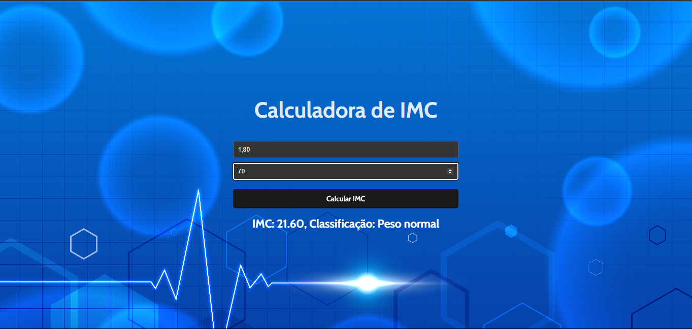

<!DOCTYPE html>
<html lang="pt-br">
<head>
    <meta charset="UTF-8">
    <meta name="viewport" content="width=device-width, initial-scale=1.0">
    <meta name="description" content="Calculadora de IMC desenvolvida em React para avaliar e educar usuários sobre seu nível de saúde baseado no IMC.">
    <meta name="keywords" content="IMC, saúde, React, calculadora">
    <meta name="author" content="Ana Alice Rodrigues">
    <link rel="icon" type="image/svg+xml" href="favicon.svg">
    <link href="https://fonts.googleapis.com/css2?family=Cabin:wght@400;700&display=swap" rel="stylesheet">
</head>
<body>

<header>
    <h1>Calculadora de IMC em React</h1>
    
</header>

    
Índice

    <ol>
        <li><a href="#sobre-o-projeto">Sobre o projeto</a></li>
        <li><a href="#parte-tecnica">Parte Técnica</a></li>
        <li><a href="#estrutura-dos-arquivos">Estrutura dos Arquivos</a></li>
        <li><a href="#casos-de-uso">Casos de Uso</a></li>
        <li><a href="#ferramentas">Ferramentas</a></li>
        <li><a href="#contato">Contato</a></li>
    </ol>

<section id="sobre-o-projeto">
    <h2>Sobre o projeto</h2>
    

        Este projeto consiste em uma aplicação web desenvolvida em React que permite aos usuários calcular seu Índice de Massa Corporal (IMC). O IMC é calculado com base no peso e altura fornecidos pelo usuário, e a aplicação retorna o valor do IMC junto com uma classificação indicativa.
    

    

        Proposta de Valor: Oferecer uma ferramenta educativa que auxilie os usuários a entenderem melhor sua saúde.
    

</section>

<section id="parte-tecnica">
    <h2>Parte Técnica</h2>
    <ul>
        <li>Backend: Não aplicável, pois é uma aplicação client-side.</li>
        <li>Frontend: Desenvolvido com ReactJS, utilizando a biblioteca Vite para otimização do ambiente de desenvolvimento.</li>
        <li>Banco de Dados: Não aplicável, pois os dados são processados localmente no navegador do usuário.</li>
    </ul>
</section>

<section id="estrutura-dos-arquivos">
    <h2>Estrutura dos Arquivos</h2>
    <ul>
        <li><code>src/App.jsx</code>: Componente principal do React que engloba a calculadora.</li>
        <li><code>src/components/</code>: Contém os componentes da interface da calculadora.</li>
        <li><code>public/</code>: Pasta que contém arquivos estáticos como imagens e o favicon.</li>
    </ul>
</section>

<section id="casos-de-uso">
    <h2>Casos de Uso</h2>
    <ul>
      <li>Usuários inserindo seus dados (peso e altura) para calcular o IMC.</li>
      <li>Usuários recebendo feedback imediato sobre sua condição de saúde baseada no IMC.</li>
    </ul>
</section>

<section id="ferramentas">
    <h2>Ferramentas</h2>
    <ul>
        <li></li>
        <li></li>
        <li></li>
        <li></li>
        <li></li>
    </ul>
</section>

<section id="contato">
    <h2>Contato</h2>
    <ul>
        <li></li>
    </ul>
</section>

</body>
</html>
